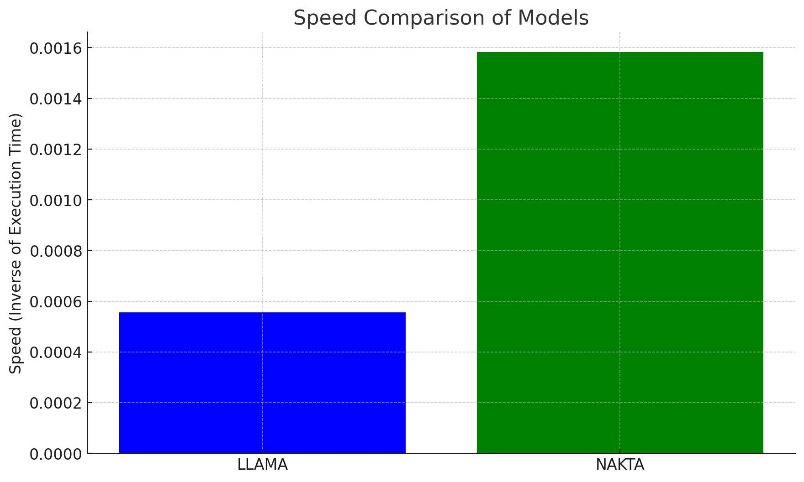

## 주요 성과
### Speed Test
#### Kernel Speed Test

| Operation          | Performance Improvement (%) |
|--------------------|----------------------------|
| Attention          | 279.11%                    |
| RMSNorm            | 392.75%                    |
| RotaryEmbedding    | 133.37%                    |
| SwiGLU             | 33.53%                     |
| Rebuild Padding | 987% |

#### Hellaswag Validation Set Speed Test
  
 

### Accuracy Test
| Model  | Accuracy |
|--------|---------|
| LLAMA  | 83.01%  | 
| Nakta  | 83.01%  |

**Accuracy drop 없이 2.87배 빠른 모델 구현**
## 실행 가이드
### 환경 구축
repository 를 clone 후 다음 스크립트를 실행해주세요.  
<code>
chmode +x ./setting.sh  
./setting.sh
</code>  

### weight 변환 
<code>  
python convert.py {original weight path} {output path}
</code>  

### speed + accuracy test 실행
스크립트 실행전 weight 의 경로와 tokenizer 의 경로를 수정해주세요.(tokenizer 의 경우 llama original tokenizer.model 경로를 지정해주세요)  
<code>
chmod +x ./nakta5_test.sh  
./nakta5_test.sh
</code>

## 주요 구현 링크
[RMSNorm](https://github.com/AI-CE-2023/nakta/blob/main/nakta_model/kernel/Norm/RmsNorm.py)   
[Rotary Embedding](https://github.com/AI-CE-2023/nakta/blob/main/nakta_model/kernel/Emb/Rotary/rotary.py)   
[SwiGLU](https://github.com/AI-CE-2023/flash/blob/main/csrc/flash_attn/activation_kernel.cu)  
[Rebuild Padding](https://github.com/AI-CE-2023/nakta/blob/main/nakta_model5/kernel/Pad/repad.py)
*Memory Efficient Attention 의 경우 Pytorch 2.0.0 의 구현을 사용하였음.

## 참고 프로젝트 
  - Accuracy Test: https://github.com/EleutherAI/lm-evaluation-harness
  - Rotary Embedding, RMSNorm: https://github.com/openai/triton https://github.com/Dao-AILab/flash-attention
  
